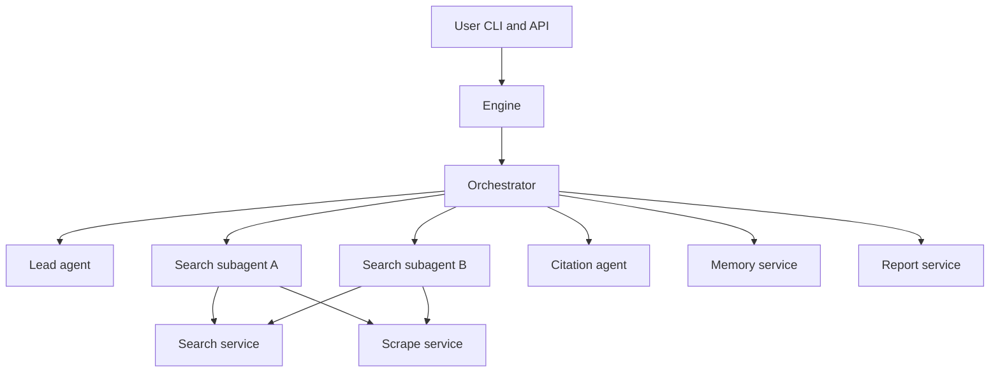
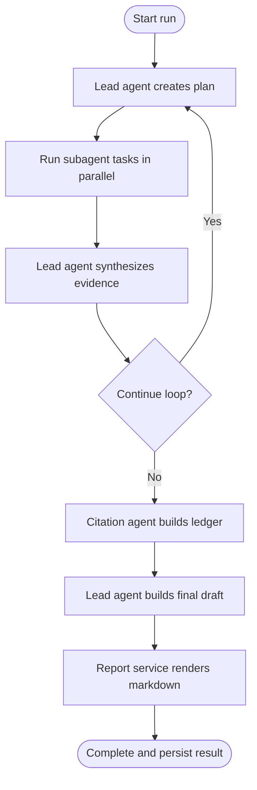
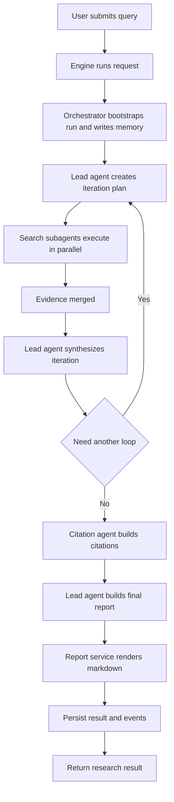
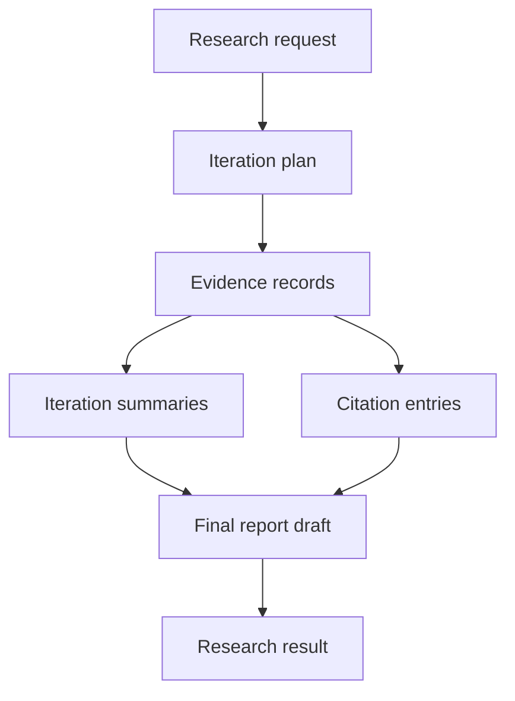
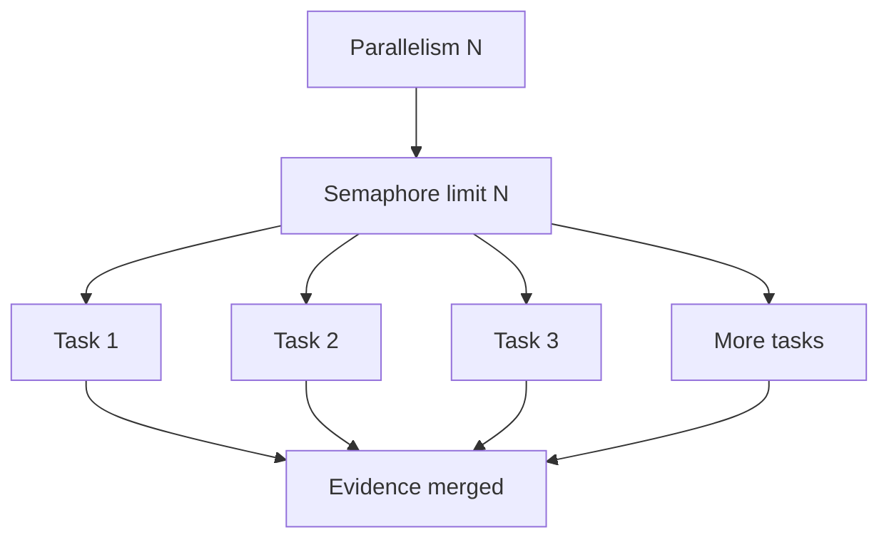

# Shandu 3.0 Architecture

This document describes how Shandu 3.0 executes research runs end-to-end.

## 1) System Topology

## 2) Iterative Run Loop

## 3) Control Flow (Vertical)

## 4) Data Model Pipeline

## 5) Parallelism Model

- `--parallelism` is the hard upper bound for concurrent subagent task execution per iteration.
- The planner attempts to generate enough independent tasks to use requested parallelism.
- The orchestrator enforces concurrency with an async semaphore.

## 6) Citation Guarantees

- Final rendered reports use numeric citation markers only (`[1]`, `[2]`, ...).
- Internal evidence IDs are removed from rendered markdown.
- References are rebuilt from citation ledger ordering for stable output.

## 7) Module Boundaries (Black Box View)

- Engine: public runtime entrypoint (`run`, `stream`, `inspect`, `ai_search`).
- Orchestrator: iterative loop control, task fan-out, progress events, and result assembly.
- Lead agent: planning, synthesis, and final report drafting.
- Search subagents: evidence retrieval and extraction for each planned task.
- Citation agent: citation ledger generation and normalization.
- Search service: web search backend abstraction.
- Scrape service: URL canonicalization, page fetch, and content extraction.
- Memory service: persistent run memory and retrieval.
- Report service: citation normalization and final markdown rendering.
- AI search service: one-shot search + explanation workflow.
- Runtime bootstrap: model/runtime/memory wiring.
- Terminal UI: live progress, dashboards, and final display panels.

## 8) Example Output

- Example long-form report: see the `examples` directory.
