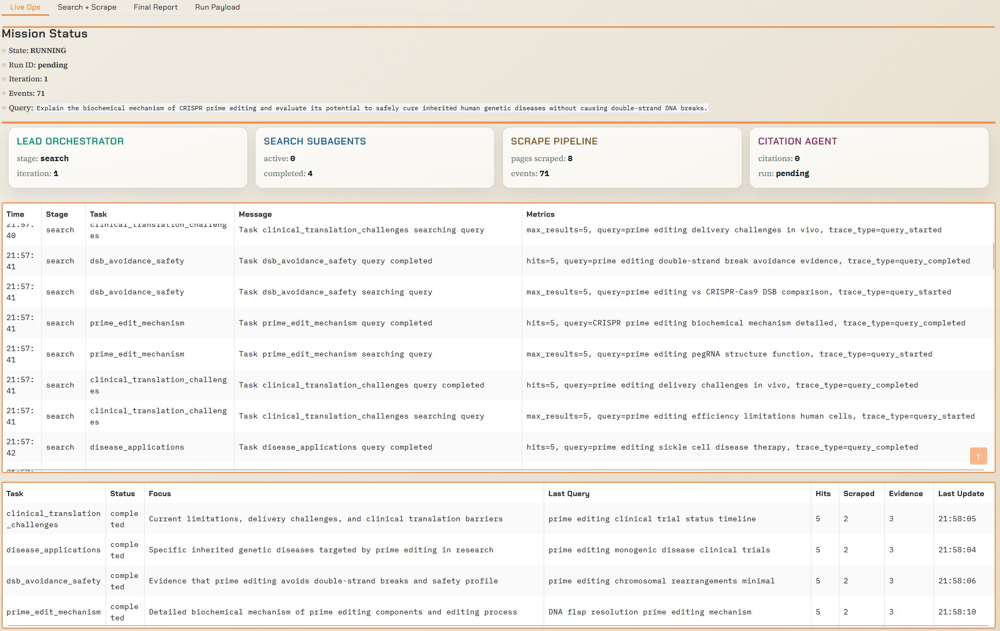

# Shandu

Shandu is a Blackgeorge-powered, lead-orchestrated multi-agent research system.

- Architecture deep dive: [`ARCH.md`](ARCH.md)
- Example long-form output: see the `examples` directory.

## Architecture

- Lead orchestrator plans iterative research loops.
- Parallel search subagents retrieve and extract web evidence.
- Citation subagent builds the final reference ledger.
- SQLite-backed memory tracks run context across steps.
- Rich CLI control deck renders run metrics and timeline.
- Gradio GUI control room provides live telemetry, task views, and report download.
- Scraper pipeline normalizes URLs, strips boilerplate HTML, and favors main-content blocks.

## Installation

Recommended for end users (no manual venv management):

```bash
pipx install shandu
```

Standard pip install:

```bash
pip install shandu
```

Install latest from GitHub:

```bash
pipx install "git+https://github.com/jolovicdev/shandu.git@main"
```

## Quick Start

```bash
uv sync --dev
source .venv/bin/activate
cp .env.example .env
# edit .env with your provider/model settings
```

## API Key Configuration (LiteLLM Style)

`shandu configure` now asks for:

- `Default model` (example: `deepseek/deepseek-chat`, `openrouter/minimax/minimax-m2.5`)
- `API key env var name` (example: `DEEPSEEK_API_KEY`, `OPENROUTER_API_KEY`, `ANYSUPPORTED_API_KEY`)
- `API key value` (hidden input)

Shandu saves these in user config storage and exports the configured env var at runtime for LiteLLM if it is not already set in your shell.

Examples:

```bash
# DeepSeek
shandu configure
# model: deepseek/deepseek-chat
# env var name: DEEPSEEK_API_KEY
# key value: <your key>

# OpenRouter
shandu configure
# model: openrouter/minimax/minimax-m2.5
# env var name: OPENROUTER_API_KEY
# key value: <your key>
```

You can still configure keys only through shell env vars if you prefer:

```bash
export OPENROUTER_API_KEY="your_real_key"
```

## Environment Variables (Without `shandu configure`)

If you prefer not to use interactive configuration, set env vars directly.

Provider/model:

- `SHANDU_MODEL` (primary model selector, example `deepseek/deepseek-chat`)
- `OPENAI_MODEL_NAME` (compatibility fallback if `SHANDU_MODEL` is not set)

Provider API key routing:

- `SHANDU_API_KEY_ENV` (name of provider key env var, example `OPENROUTER_API_KEY`)
- `SHANDU_API_KEY` (actual key value that Shandu exports into `SHANDU_API_KEY_ENV` at runtime if missing)

Direct LiteLLM-style provider key env vars (examples):

- `DEEPSEEK_API_KEY`
- `OPENROUTER_API_KEY`
- `ANTHROPIC_API_KEY`
- `OPENAI_API_KEY`
- Any other provider key name LiteLLM supports, for example `ANYSUPPORTED_API_KEY`

Generation/runtime controls:

- `SHANDU_TEMPERATURE` (default `0.2`)
- `SHANDU_MAX_TOKENS` (default `8192`)
- `SHANDU_STORAGE_DIR` (default `.blackgeorge`)
- `SHANDU_PROXY` (optional proxy for scraping)

Precedence:

1. If your provider key env var (for example `OPENROUTER_API_KEY`) is already set in shell, Shandu uses it.
2. Otherwise, Shandu uses `SHANDU_API_KEY_ENV` + `SHANDU_API_KEY` from config/env.

## CLI

```bash
shandu run "Who is the current president of the United States?" \
  --max-iterations 1 \
  --parallelism 2 \
  --max-results-per-query 2 \
  --max-pages-per-task 2 \
  --output report.md
```

`--parallelism` controls the maximum number of subagent tasks that execute concurrently inside each iteration. If set to `2`, the lead planner creates at least two independent tasks when possible, and the orchestrator runs up to two tasks at the same time.

During `shandu run`, progress events stream live in the terminal:

- `BOOTSTRAP` / `PLAN` / `SEARCH` / `SYNTHESIZE` / `CITE` / `REPORT` / `COMPLETE`
- Per-task search events (`Task <id> started` and `Task <id> completed`) with metrics
- Iteration index and task IDs for long-running model calls
- Run summary includes model call count across lead/subagents/citation
- Metered calls/tokens/cost appear when provider exposes billing/usage metrics

```bash
shandu aisearch "latest state of open-source browser automation in 2026" \
  --max-results 8 \
  --max-pages 3 \
  --detail-level high \
  --output aisearch.md
```

`aisearch` returns classic behavior: web search + synthesized explanation with source citations.

Citation behavior:

- Final reports enforce numeric citation markers (`[1]`, `[2]`, ...).
- Raw internal evidence IDs are removed from the rendered markdown.
- The final `## References` section is rendered from the citation ledger to keep numbering stable.

Other commands:

- `shandu info`
- `shandu configure`
- `shandu gui`
- `shandu aisearch <query>`
- `shandu inspect <run_id>`
- `shandu clean`

### GUI

Launch the visual control room:

```bash
shandu gui --host 127.0.0.1 --port 7860
```

`gradio` ships with the default Shandu install, so `shandu gui` works out of the box.

GUI features:

- live run stage timeline (`BOOTSTRAP` through `COMPLETE`)
- per-subagent task board (status, focus, last query, evidence)
- search/scrape trace stream (query start/finish, hit counts, URLs scraped, extraction/fallback signals)
- final report + citation ledger panels
- one-click markdown download button after run completion
- run cost display (`usd_spent`) when provider exposes cost metrics
- runtime configuration editing (model, provider env var name, key, iteration/parallelism/search limits)

### GUI Preview

#### Main Screen



#### Tables View


#### Report View


## Python API

```python
from shandu import ResearchRequest, ShanduEngine

engine = ShanduEngine.from_config()
result = engine.run_sync(
    ResearchRequest(
        query="AI inference infrastructure 2026",
        max_iterations=2,
        parallelism=3,
    )
)
print(result.report_markdown)
```

## Development

```bash
uv run ruff check .
uv run pytest -q
```

## Scraper Notes

- Requests use a browser-like user agent and language headers.
- URLs are canonicalized and deduplicated before fetch.
- Extraction prioritizes `article` / `main` / `role=main` content, then falls back to body text.
- Repeated or very short blocks are filtered to reduce navigation/cookie noise.

MIT license.
