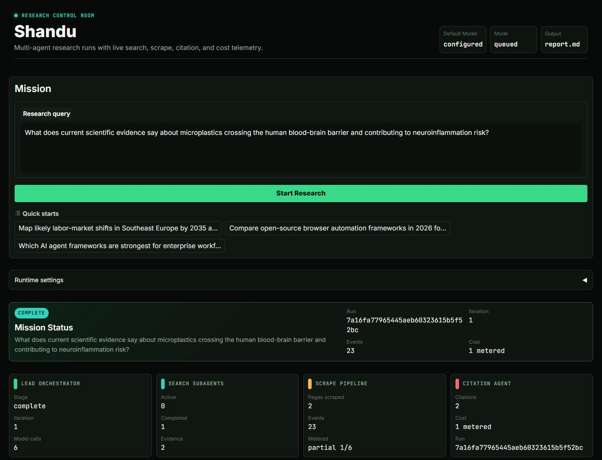
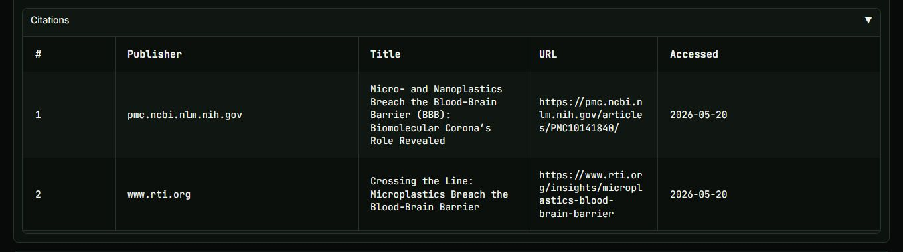

# Shandu - Open-Source Deep Research Agent (CLI + GUI)

Shandu is a Python deep research agent: ask a question, and a team of LLM agents
plans research loops, runs web searches, scrapes pages and documents, scores every
source for credibility, and writes a long-form markdown report with numbered
citations. It covers the same ground as hosted deep-research tools (OpenAI Deep
Research, Perplexity, Gemini), but it is open source and runs on your own machine
with any model LiteLLM supports: DeepSeek, OpenRouter, Anthropic, OpenAI, or a
local endpoint. Built on the Blackgeorge agent framework, usable from a terminal
CLI or a Gradio web GUI.

- Architecture deep dive: [`ARCH.md`](ARCH.md)
- Example long-form output: see the `examples` directory.
- DeepSeek Flash example: [`examples/deepseek-flash.md`](examples/deepseek-flash.md)

## How It Works

- Lead orchestrator plans iterative research loops (plan, search, synthesize, repeat).
- Parallel search subagents run web search and evidence extraction concurrently.
- Citation subagent builds the final reference ledger.
- SQLite-backed memory tracks run context across steps.
- Rich CLI control deck renders run metrics and timeline.
- Gradio GUI control room provides live telemetry, task views, and report download.
- Scraper pipeline normalizes URLs, strips boilerplate HTML, and favors main-content blocks.

## Installation

Recommended for end users (no manual venv management):

```bash
pipx install shandu
```

Standard pip install:

```bash
pip install shandu
```

Install latest from GitHub:

```bash
pipx install "git+https://github.com/jolovicdev/shandu.git@main"
```

## Quick Start

```bash
uv sync --dev
source .venv/bin/activate
cp .env.example .env
# edit .env with your provider/model settings
```

## API Key Configuration (LiteLLM Style)

`shandu configure` now asks for:

- `Default model` (example: `deepseek/deepseek-v4-flash`, `openrouter/minimax/minimax-m2.5`)
- `API key env var name` (example: `DEEPSEEK_API_KEY`, `OPENROUTER_API_KEY`, `ANYSUPPORTED_API_KEY`)
- `API key value` (hidden input)

Shandu saves these in user config storage and exports the configured env var at runtime for LiteLLM if it is not already set in your shell.

Examples:

```bash
# DeepSeek
shandu configure
# model: deepseek/deepseek-v4-flash
# env var name: DEEPSEEK_API_KEY
# key value: <your key>

# OpenRouter
shandu configure
# model: openrouter/minimax/minimax-m2.5
# env var name: OPENROUTER_API_KEY
# key value: <your key>
```

You can still configure keys only through shell env vars if you prefer:

```bash
export OPENROUTER_API_KEY="your_real_key"
```

## Environment Variables (Without `shandu configure`)

If you prefer not to use interactive configuration, set env vars directly.

Provider/model:

- `SHANDU_MODEL` (primary model selector, example `deepseek/deepseek-v4-flash`)
- `OPENAI_MODEL_NAME` (compatibility fallback if `SHANDU_MODEL` is not set)

Provider API key routing:

- `SHANDU_API_KEY_ENV` (name of provider key env var, example `OPENROUTER_API_KEY`)
- `SHANDU_API_KEY` (actual key value that Shandu exports into `SHANDU_API_KEY_ENV` at runtime if missing)

Direct LiteLLM-style provider key env vars (examples):

- `DEEPSEEK_API_KEY`
- `OPENROUTER_API_KEY`
- `ANTHROPIC_API_KEY`
- `OPENAI_API_KEY`
- Any other provider key name LiteLLM supports, for example `ANYSUPPORTED_API_KEY`

Generation/runtime controls:

- `SHANDU_TEMPERATURE` (default `0.2`)
- `SHANDU_MAX_TOKENS` (default `16384`)
- `SHANDU_STORAGE_DIR` (default `.blackgeorge`)
- `SHANDU_PROXY` (optional proxy for scraping)

Precedence:

1. If your provider key env var (for example `OPENROUTER_API_KEY`) is already set in shell, Shandu uses it.
2. Otherwise, Shandu uses `SHANDU_API_KEY_ENV` + `SHANDU_API_KEY` from config/env.

## CLI

```bash
shandu run "Who is the current president of the United States?" \
  --max-iterations 1 \
  --parallelism 2 \
  --max-results-per-query 2 \
  --max-pages-per-task 2 \
  --output report.md
```

`--parallelism` controls the maximum number of subagent tasks that execute concurrently inside each iteration. If set to `2`, the lead planner creates at least two independent tasks when possible, and the orchestrator runs up to two tasks at the same time.

During `shandu run`, progress events stream live in the terminal:

- `BOOTSTRAP` / `PLAN` / `SEARCH` / `SYNTHESIZE` / `CITE` / `REPORT` / `COMPLETE`
- Per-task search events (`Task <id> started` and `Task <id> completed`) with metrics
- Iteration index and task IDs for long-running model calls
- Run summary includes model call count across lead/subagents/citation
- Metered calls/tokens/cost appear when provider exposes billing/usage metrics

```bash
shandu aisearch "latest state of open-source browser automation in 2026" \
  --max-results 8 \
  --max-pages 3 \
  --detail-level high \
  --output aisearch.md
```

`aisearch` is the quick mode: a single Perplexity-style answer built from live web
search, with source citations, when a full deep-research run is more than you need.

Citation behavior:

- Final reports enforce numeric citation markers (`[1]`, `[2]`, ...).
- Raw internal evidence IDs are removed from the rendered markdown.
- The final `## References` section is rendered from the citation ledger to keep numbering stable.

Other commands:

- `shandu info`
- `shandu configure`
- `shandu gui`
- `shandu aisearch <query>`
- `shandu inspect <run_id>`
- `shandu clean`

### GUI

Launch the visual control room:

```bash
shandu gui --host 127.0.0.1 --port 7860
```

`gradio` ships with the default Shandu install, so `shandu gui` works out of the box.

GUI features:

- live run stage timeline (`BOOTSTRAP` through `COMPLETE`)
- per-subagent task board (status, focus, last query, evidence)
- search/scrape trace stream (query start/finish, hit counts, URLs scraped, extraction/fallback signals)
- final report + citation ledger panels
- one-click markdown download button after run completion
- run cost display (`usd_spent`) when provider exposes cost metrics
- runtime configuration editing (model, provider env var name, key, iteration/parallelism/search limits)

### GUI Preview

#### Main Screen



#### Report View


#### Citation Ledger



## Python API

```python
from shandu import ResearchRequest, ShanduEngine

engine = ShanduEngine.from_config()
result = engine.run_sync(
    ResearchRequest(
        query="AI inference infrastructure 2026",
        max_iterations=2,
        parallelism=3,
    )
)
print(result.report_markdown)
engine.close()  # release the shared HTTP session
```

## Development

```bash
uv run ruff check .
uv run pytest -q
```

## Web Scraping Pipeline

- Three-layer HTML extraction: trafilatura → readability-lxml → BS4.
- Document-format support: PDF, DOCX, XLSX, CSV, plaintext, markdown.
- Structured blocks preserve headings, tables, code, blockquotes, and list items.
- Per-domain rate limiting with exponential backoff; 3 retry attempts with jitter.
- Fetch-error detection: paywall, captcha, empty JS shell, blocked, login-required.
- Publication-date extraction from OpenGraph, JSON-LD, DC, prism, sailthru, parsely meta tags.
- In-flight deduplication prevents concurrent duplicate fetches of the same URL.
- Redirect-aware: pages tracked by requested URL so redirects don't cause false misses.

## Source-Quality Enforcement

A research agent is only as good as what it cites. Shandu grades every page it
reads instead of treating all search results as equal, so reports lean on primary
sources and peer-reviewed work rather than SEO farms, undated blogs, and
marketing pages.

- The per-page extractor classifies each source on the existing extraction call (primary, official, peer-reviewed, journalism, corporate, community, personal blog, advocacy/marketing, aggregator, social profile, or unknown) and records authorship, dating, and whether the page only summarizes work it does not contain.
- Each evidence record carries a `source_class`, a `credibility_score` derived from those signals, and `quality_flags` such as `undated`, `no_author`, `promotional`, `snippet_only`, or `unassessed`.
- The synthesizer and reporter weight claims by credibility and name weak-only support explicitly; undated evidence is treated as stale for time-sensitive queries.
- The adaptive loop treats high-confidence but low-credibility evidence as weak, so weak-source corpora keep searching; run stats report source-class counts and the fraction of dated evidence.
- The citation ledger excludes evidence below the credibility bar (weak pages can still inform caveats in prose), merges URL variants of the same work (abstract/HTML/PDF) into one reference, and sanitizes boilerplate titles.

MIT license.
